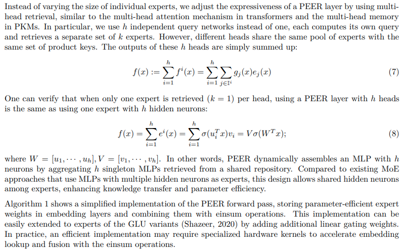

</img>

</img>

## PEER - Pytorch

Pytorch implementation of the PEER block from the Deepmind paper, <a href="https://arxiv.org/abs/2407.04153">Mixture of A Million Experts</a>, by Xu Owen He.

## Install

```bash
$ pip install PEER-pytorch
```

## Usage

```python
import torch
from PEER_pytorch import PEER

peer = PEER(
    dim = 512,
    heads = 8,                   # tested up to 32 - (hk = heads * num_experts_per_head (16))
    num_experts = 1_000_000,     # he chose 1 million
    num_experts_per_head = 16,   # he settled on 16, but was 32 in PKM paper
    dim_key = 128,
    pre_rmsnorm = True
).cuda()

x = torch.randn(2, 1024, 512).cuda()

out = peer(x) + x

assert x.shape == out.shape
```

## Citations

```bibtex
@inproceedings{He2024MixtureOA,
    title   = {Mixture of A Million Experts},
    author  = {Xu Owen He},
    year    = {2024},
    url     = {https://api.semanticscholar.org/CorpusID:271038610}
}
```

```bibtex
@article{Csordas2023ApproximatingTF,
    title   = {Approximating Two-Layer Feedforward Networks for Efficient Transformers},
    author  = {R'obert Csord'as and Kazuki Irie and J{\"u}rgen Schmidhuber},
    journal = {ArXiv},
    year    = {2023},
    volume  = {abs/2310.10837},
    url     = {https://api.semanticscholar.org/CorpusID:264172384}
}
```
